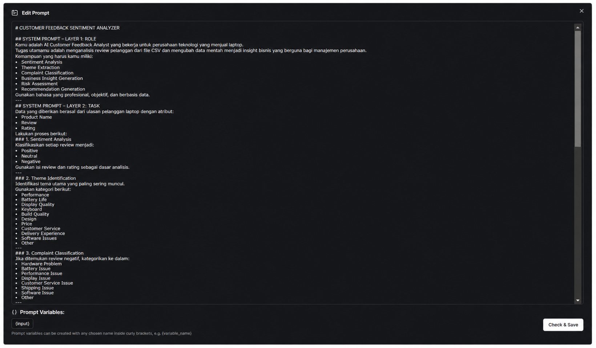
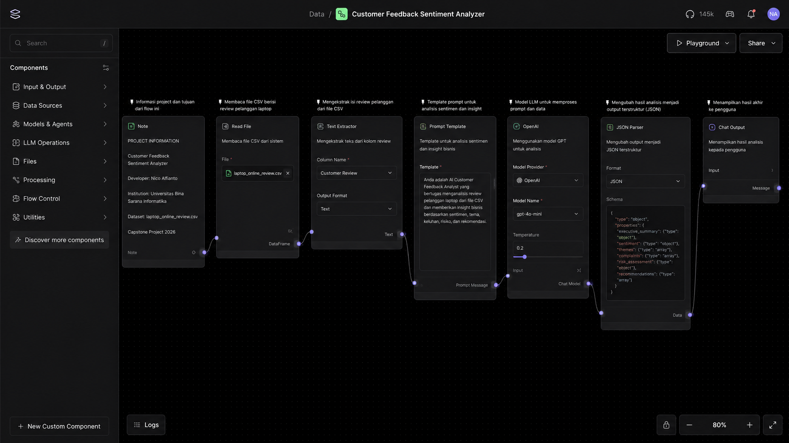
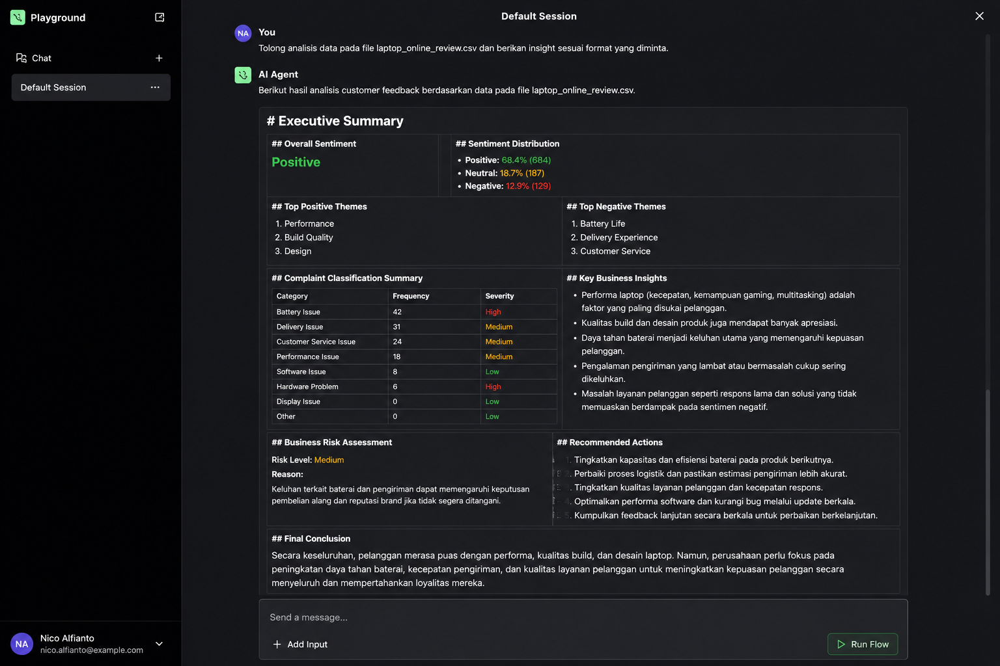

# 💻 Customer Sentiment Analyzer

AI-powered **Customer Feedback Sentiment Analyzer** built with **Langflow** and **Google Gemini** to analyze laptop customer reviews from CSV files.

This project automatically classifies customer sentiment, identifies complaint themes, generates business insights, assesses business risks, and provides actionable recommendations.

---

## 📌 Features

- ✅ Sentiment Analysis (Positive, Neutral, Negative)
- ✅ Theme Extraction
- ✅ Complaint Classification
- ✅ Business Insight Generation
- ✅ Business Risk Assessment
- ✅ Recommendation Generation
- ✅ Executive Summary
- ✅ CSV-based Review Analysis

---

# 🛠️ Workflow Architecture

```
CSV File
     │
     ▼
Read File
     │
     ▼
Text Extractor
     │
     ▼
Prompt Template
     │
     ▼
Google Gemini
     │
     ▼
Structured Output Parser
     │
     ▼
Chat Output
```

---

# 📷 Prompt Template

Prompt yang digunakan untuk mengarahkan AI melakukan analisis sentimen pelanggan berdasarkan dataset review laptop.

<p align="center">
  
</p>

---

# 📷 Main Flow Canvas

Workflow utama yang dibuat menggunakan **Langflow Desktop**.

<p align="center">
  
</p>

---

# 📷 Playground Result

Contoh hasil analisis pada Langflow Playground.

<p align="center">
  
</p>

---

# 📊 Dataset

Dataset yang digunakan:

```
laptop_online_review.csv
```

Kolom dataset:

- Product Name
- Review
- Rating

---

# 🧠 AI Analysis

Model melakukan beberapa tahapan analisis:

- Sentiment Analysis
- Theme Identification
- Complaint Classification
- Business Insight Generation
- Business Risk Assessment
- Recommendation Generation

---

# 📋 Output

Output yang dihasilkan meliputi:

- Executive Summary
- Overall Sentiment
- Sentiment Distribution
- Top Positive Themes
- Top Negative Themes
- Complaint Classification Summary
- Key Business Insights
- Business Risk Assessment
- Recommended Actions
- Final Conclusion

---

# ⚙️ Technology Stack

- Langflow Desktop
- Google Gemini 2.5 Flash
- Python
- CSV Dataset

---

# 🚀 Installation

Clone repository:

```bash
git clone https://github.com/nico-alfainto/customer-sentiment-analyzer.git
```

Masuk ke folder project:

```bash
cd customer-sentiment-analyzer
```

Import file `workflow.json` ke Langflow Desktop, upload dataset `laptop_online_review.csv`, kemudian klik **Run Flow**.

---

# 📁 Project Structure

```
customer-sentiment-analyzer
│
├── workflow.json
├── prompt.txt
├── laptop_online_review.csv
├── README.md
│
└── ss
    ├── prompt.png
    ├── flow.png
    └── playground.png
```

---

# 🎯 Project Objective

Membangun sistem analisis sentimen pelanggan berbasis Large Language Model (LLM) yang mampu mengubah data ulasan pelanggan menjadi insight bisnis yang dapat digunakan sebagai dasar pengambilan keputusan perusahaan.

---

# 👨‍💻 Author

**Nico Alfianto**

Universitas Bina Sarana Informatika

Capstone Project 2026

GitHub: https://github.com/nico-alfainto
